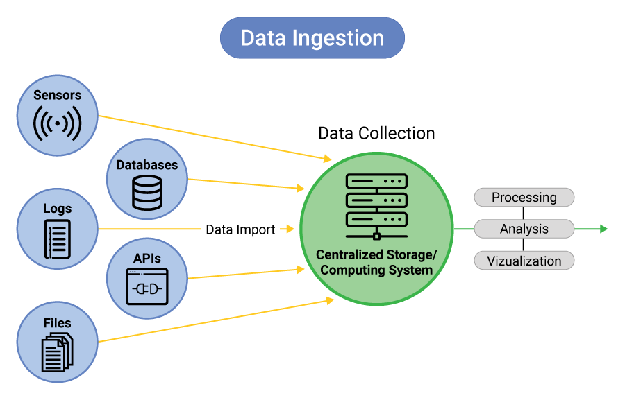

# Flight Price Prediction
- In this project i will build a flight price prediction model that can predict the price of flight based on its factor.
- I can approcah this project using `MLOPs` principal.
- We can also use all the `open source` as i needed in this project.

# Project Folder Structure
This repository includes a script, `template.py`, which automates the creation of the project structure. Running this script will automatically create the necessary folders and files for your project.

| Folder/File                           | Description                        |
|---------------------------------------|------------------------------------|
| `Data/Raw/`                           | Folder for raw data                 |
| `Data/Process/`                       | Folder for processed data           |
| `src/Components/`                    | Source code for components          |
| `src/Components/__init__.py`          | Initialization for components       |
| `src/Components/data_ingestion.py`    | Data ingestion script               |
| `src/Components/data_transformation.py` | Data transformation script         |
| `src/Components/model_training.py`    | Model training script               |
| `src/Pipelines/`                     | Source code for pipelines           |
| `src/Pipelines/__init__.py`           | Initialization for pipelines        |
| `src/Pipelines/Prediction_pipeline.py` | Prediction pipeline script         |
| `Models/`                            | Folder for models                   |
| `Notebooks/`                         | Folder for Jupyter notebooks        |
| `app.py`                             | Main application script             |
| `test_environment.py`                | Script to test the environment      |
| `Dockerfile`                         | Dockerfile for containerization     |
| `.dockerignore`                      | Docker ignore file                  |
| `setup.py`                           | Setup script for packaging          |
| `requirements.txt`                   | Python package requirements         |
| `src/__init__.py`                    | Initialization for the src package  |
| `src/utils.py`                       | Utility functions                   |

# Data Ingestion
- In this step i can read the data form any source so in this case i have store the data in my local folder
- But generally in this step we can get all the data form all the sources and combine them into single data.
- In this step we can also do basic data cleaning like handling missing values, removing duplicates and handling data types

# Feature Engnering
- In feature feature engnering we can make a new and meaningful feature so that our model can learn better.

- **We can do following feature engnering**
- Convert the duration to minutes.
- Convert total stops into integer format.
- Extract departure and arrival hours and minutes.
- Separate the month, year, and day from the journey date.
- Rename business airlines to normal airlines.
- Remove unnecessary columns.
- Remove rows with 4 stops (outliers).
- Save the cleaned data to the process folder.
- Split the data into train and test sets.
- Save the train and test data to the process folder.

## Feature Engineering Steps

| Step | Description |
|------|-------------|
| 1    | **Convert Duration to Minutes:** Convert flight duration from hours and minutes to total minutes. |
| 2    | **Convert Total Stops:** Convert total stops from string format to integer format. |
| 3    | **Extract Departure Time:** Extract departure hours and minutes from the departure time. |
| 4    | **Extract Arrival Time:** Extract arrival hours and minutes from the arrival time. |
| 5    | **Separate Journey Date:** Extract year, month, and day from the journey date. |
| 6    | **Rename Airlines:** Standardize airline names for consistency. |
| 7    | **Remove Unnecessary Columns:** Drop columns that are not needed for modeling. |
| 8    | **Remove Outliers:** Remove rows with 4 stops as they are considered outliers. |
| 9    | **Save Clean Data:** Save the cleaned dataset to the process folder. |
| 10   | **Split Data:** Split the data into training and testing sets. |
| 11   | **Save Split Data:** Save the training and testing sets to the process folder. |
