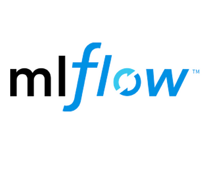
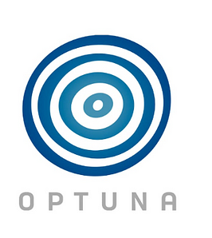
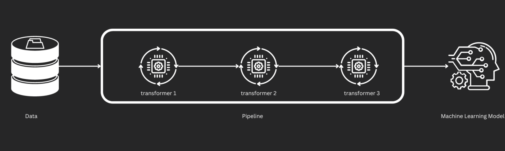
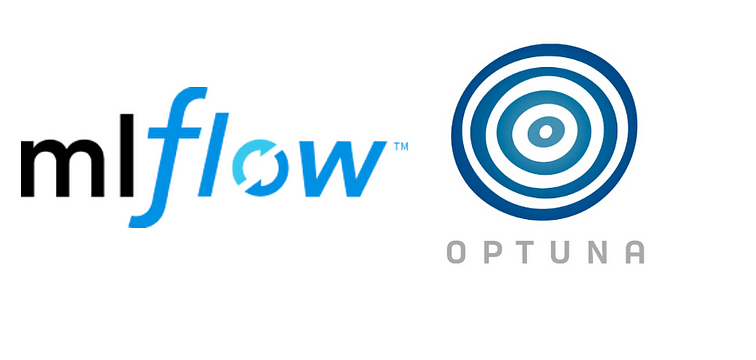

# Flight Price Prediction
- In this project i will build a flight price prediction model that can predict the price of flight based on its factor.
- I can approcah this project using `MLOPs` principal.
- We can also use all the `open source` as i needed in this project.

## Tools Used in This Project
| Category                      | Tools                        | Image |
|-------------------------------|------------------------------|-------|
| Data Manipulation and Visualization | NumPy, pandas, matplotlib, seaborn |     |
| Model Training and Monitoring | scikit-learn, MLflow         |   |
| Hyperparameter Tuning         | Optuna                       |  |
| Web Application               | Streamlit                    |  |
| Containerization              | Docker, GitHub Actions       |   |

# Project Folder Structure
This repository includes a script, `template.py`, which automates the creation of the project structure. Running this script will automatically create the necessary folders and files for your project.


| Folder/File                           | Description                        |
|---------------------------------------|------------------------------------|
| `Data/Raw/`                           | Folder for raw data                 |
| `Data/Process/`                       | Folder for processed data           |
| `src/Components/`                    | Source code for components          |
| `src/Components/__init__.py`          | Initialization for components       |
| `src/Components/data_ingestion.py`    | Data ingestion script               |
| `src/Components/data_transformation.py` | Data transformation script         |
| `src/Components/model_training.py`    | Model training script               |
| `src/Pipelines/`                     | Source code for pipelines           |
| `src/Pipelines/__init__.py`           | Initialization for pipelines        |
| `src/Pipelines/Prediction_pipeline.py` | Prediction pipeline script         |
| `Models/`                            | Folder for models                   |
| `Notebooks/`                         | Folder for Jupyter notebooks        |
| `app.py`                             | Main application script             |
| `test_environment.py`                | Script to test the environment      |
| `Dockerfile`                         | Dockerfile for containerization     |
| `.dockerignore`                      | Docker ignore file                  |
| `setup.py`                           | Setup script for packaging          |
| `requirements.txt`                   | Python package requirements         |
| `src/__init__.py`                    | Initialization for the src package  |
| `src/utils.py`                       | Utility functions                   |

# Data Ingestion
- In this step i can read the data form any source so in this case i have store the data in my local folder
- But generally in this step we can get all the data form all the sources and combine them into single data.
- In this step we can also do basic data cleaning like handling missing values, removing duplicates and handling data types


# Feature Engnering
- In feature feature engnering we can make a new and meaningful feature so that our model can learn better.

- **We can do following feature engnering**
- Convert the duration to minutes.
- Convert total stops into integer format.
- Extract departure and arrival hours and minutes.
- Separate the month, year, and day from the journey date.
- Rename business airlines to normal airlines.
- Remove unnecessary columns.
- Remove rows with 4 stops (outliers).
- Save the cleaned data to the process folder.
- Split the data into train and test sets.
- Save the train and test data to the process folder.

## Feature Engineering Steps

| Step | Description |
|------|-------------|
| 1    | **Convert Duration to Minutes:** Convert flight duration from hours and minutes to total minutes. |
| 2    | **Convert Total Stops:** Convert total stops from string format to integer format. |
| 3    | **Extract Departure Time:** Extract departure hours and minutes from the departure time. |
| 4    | **Extract Arrival Time:** Extract arrival hours and minutes from the arrival time. |
| 5    | **Separate Journey Date:** Extract year, month, and day from the journey date. |
| 6    | **Rename Airlines:** Standardize airline names for consistency. |
| 7    | **Remove Unnecessary Columns:** Drop columns that are not needed for modeling. |
| 8    | **Remove Outliers:** Remove rows with 4 stops as they are considered outliers. |
| 9    | **Save Clean Data:** Save the cleaned dataset to the process folder. |
| 10   | **Split Data:** Split the data into training and testing sets. |
| 11   | **Save Split Data:** Save the training and testing sets to the process folder. |


# Data Transformation Pipeline

This module performs feature transformation steps necessary for preparing data for machine learning models. It handles tasks such as imputing missing values, encoding categorical features, and scaling numerical features.

## Overview

The `data_transformation_config` class includes methods for reading data, separating features from labels, applying transformations, and saving the processed data.

## Features

| **Feature**           | **Description**                                             |
|-----------------------|-------------------------------------------------------------|
| **Imputation**        | Fills missing values in numerical and categorical columns. |
| **Encoding**          | Converts categorical columns to numerical format using one-hot encoding. |
| **Scaling**           | Standardizes numerical columns to have zero mean and unit variance. |
| **Saving Processor**  | Saves the transformation pipeline model for future use.    |




# Model Training and Monetring
This script is designed to train and evaluate multiple regression models to select the best-performing model based on evaluation metrics. It integrates with Optuna for hyperparameter tuning and MLflow for experiment tracking.

## Script Components
- `pandas`
- `numpy`
- `scikit-learn`
- `mlflow`
- `logging`

### Data Preparation

- **Input**: `train_array` and `test_array` (arrays containing both features and target values)
- **Process**:
  - Separates input features (`x_train`, `x_test`) and output labels (`y_train`, `y_test`) from the provided arrays.

### Models

- **Linear Regression**: `LinearRegression()`
- **Random Forest Regressor**: `RandomForestRegressor()`
- **AdaBoost Regressor**: `AdaBoostRegressor()`
- **Gradient Boosting Regressor**: `GradientBoostingRegressor()`
- **Bagging Regressor**: `BaggingRegressor()`
- **Decision Tree Regressor**: `DecisionTreeRegressor()`

# Hyperparameter Tunning
- After training the models we can find the best model and apply the hyperparameter tunning uisng `OPTUNA`.
- After hyperparameter tunning we can find the best model we can save and register the model using `mlflow registry`



# Convert to Web App
- **After obtaining the best model, we can convert it into a web app.**
- **For the web app, we can use Streamlit to build an awesome frontend interface.**

# Use Case
- **To use the application, first clone the repository to your PC.**
```python
git clone https://github.com/Sami606713/flight-price-prediction.git
```
- **After Clone the repo**
```python 
cd flight-price-prediction
```
- **Make the virtual environent**
```python
python -m venv venv
```
#### Important
- **If you want to train the model from scratch, run this command:**
```python
python test_environment.py
```

- **After running the above command, run this command to start the web app:**
```python
streamlit run app.py
```

# If any issue
- Contact me via email at `sami606713@gmail.com`
